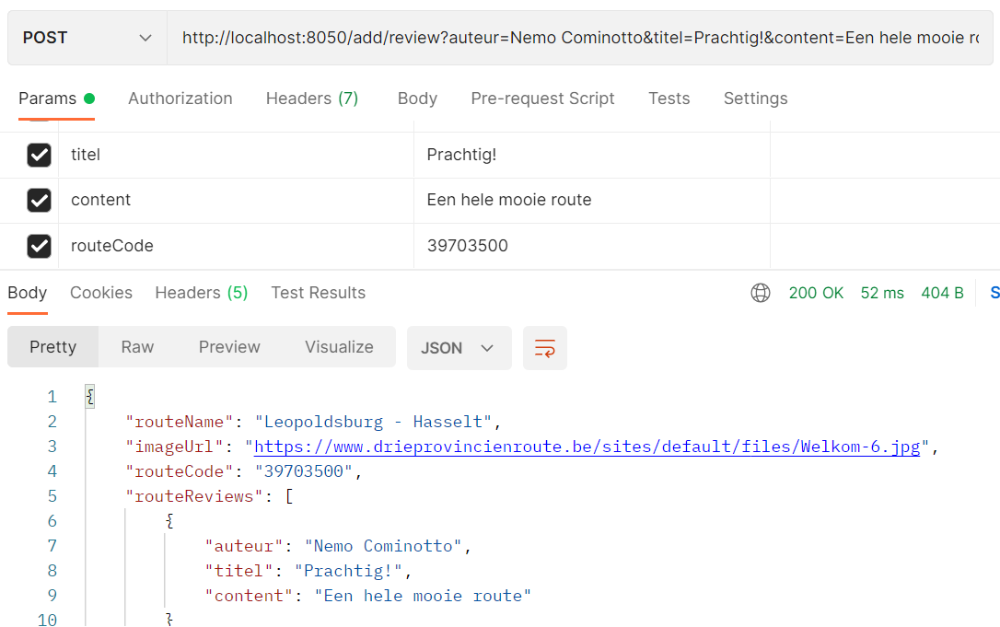

# edge-service

Onze applicatie gaat over fietsroutes. Een fietsroute behoort tot een gemeente en in een gemeente kunnen meerdere routes zijn. Ook kunnen fietsers een geschreven review met naam achterlaten bij een route. Een route kan dan ook meerdere reviews hebben. Er zijn get endpoints om makkelijk een review te zien + gemeente op basis van postcode en reviews op basis van routecode. Dit wordt via de workflow allemaal getest, naar Sonarcloud gestuurd op te checken en tot slot naar Docker hub geüpload. Tot slot worden de containers gedeployed naar Oktetocloud

- https://github.com/nemocominotto/review-service
- https://github.com/JulianKoppens/cycling-route-service
- https://github.com/JetzeJanssens/gemeente-service

## OktetoCloud

## SonarCloud

## Docker

## Endpoints

### GET
- /route/{routeCode}

- /review/route/{routeCode}/auteur/{auteur}

- /gemeente/route/{postcode}

- /route/gemeente/{postcode}/reviews/{routeCode}

### POST
/add/route
- name
- img_url
- routeCode
- postcode

/add/review
- auteur
- titel
- content
- routeCode

/add/gemeente
- name
- postcode

### PUT
/update/route
- name
- img_url
- postcode
- routeCode

/update/gemeente
- name

### DELETE
/delete/route/{routeCode}

/delete/gemeente/{postcode}

